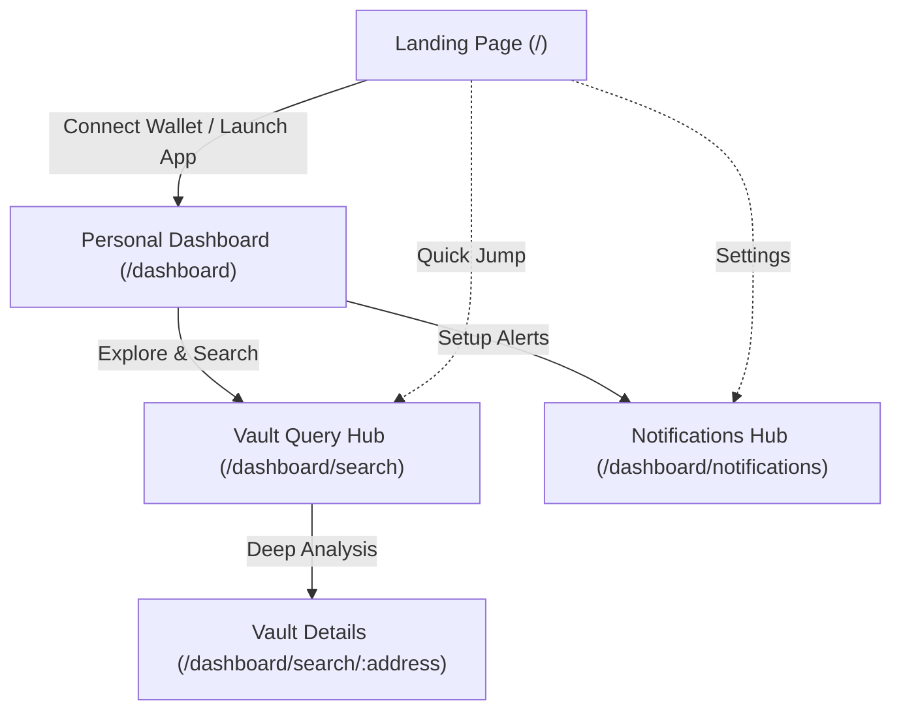

# Sentient Finance Frontend

A modern, professor-style Next.js frontend for **Sentient Finance**, a decentralized smart vault management and analysis platform built on **Chainlink**.

## Visual Flow



## App Flow Summary

- **Landing (`/`)**: Brand vision & ecosystem highlights.
- **Dashboard (`/dashboard`)**: Portfolio management & vault creation.
- **Query (`/dashboard/search`)**: Network-wide vault discovery & analysis.
- **Alerts (`/dashboard/notifications`)**: Telegram automation & monitoring.

## Maintainability Architecture (UI / Logic / Mock data)

This repository follows a strict separation of concerns to ensure fast implementation and clean future API integration:

- **UI Layer**: Route/Page components in `app/*` and pure components in `components/*`.
- **View-model Layer**: Logic and state management in `lib/view-models/*` (e.g., `useDashboardViewModel`).
- **Data Layer**: Mock data for fast prototyping in `lib/mockdata/*`.
- **Contract/Types Layer**: Core type definitions and schema in `lib/types/*`.

### Pattern Checklist

- `app/dashboard/page.tsx` ↔ `lib/view-models/use-dashboard-view-model.ts`
- `app/dashboard/notifications/page.tsx` ↔ `lib/view-models/use-notifications-view-model.ts`
- `app/dashboard/search/[address]/page.tsx` for parameterized analysis.

## Tech Stack & Shared Primitives

- **Framework**: [Next.js](https://nextjs.org/) (App Router)
- **Styling**: [Tailwind CSS](https://tailwindcss.com/)
- **Web3 Interface**: [Wagmi](https://wagmi.sh/) / Viem / WalletConnect
- **Package Manager**: [Bun](https://bun.sh/) (Recommended)

### Core UI Assets

- `components/layout/app-shell.tsx`: Main dashboard layout.
- `components/ui/*`: Reusable Primitive design tokens.
- `app/globals.css`: Dark DeFi baseline with custom tokens (`--primary`, `--card`, etc.).

## Getting Started

First, install the dependencies using Bun:

```bash
bun install
```

Then, run the development server:

```bash
bun run dev
```

Open [http://localhost:3000](http://localhost:3000) with your browser to see the result.
